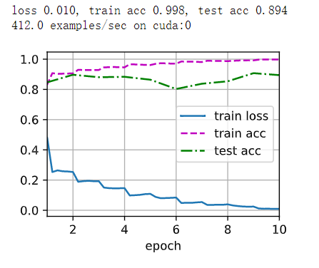

## Windows 下安装 CUDA 和 Pytorch 跑深度学习

[视频教程](https://www.bilibili.com/video/BV18K411w7Vs)

这里有一个坑，安装完成后，在jupyter notebook中跑resnet，会报错：`ModuleNotFoundError: No module named ‘mxnet‘`，需要安装GPU版本的mxnet。

先使用命令确定CUDA版本：
```
nvcc --version
```
得到CUDA版本信息
```
nvcc: NVIDIA (R) Cuda compiler driver
Copyright (c) 2005-2022 NVIDIA Corporation
Built on Wed_Jun__8_16:59:34_Pacific_Daylight_Time_2022
Cuda compilation tools, release 11.7, V11.7.99
Build cuda_11.7.r11.7/compiler.31442593_0
```
安装支持CUDA 11.7版本的mxnet，默认安装最新版本
```
pip install mxnet-cu117
```
然后运行resnet测试实验，得到实验结果


跑这个实验大概花了半个多小时，从实验结果中，可以看到GPU每秒处理412个样本。